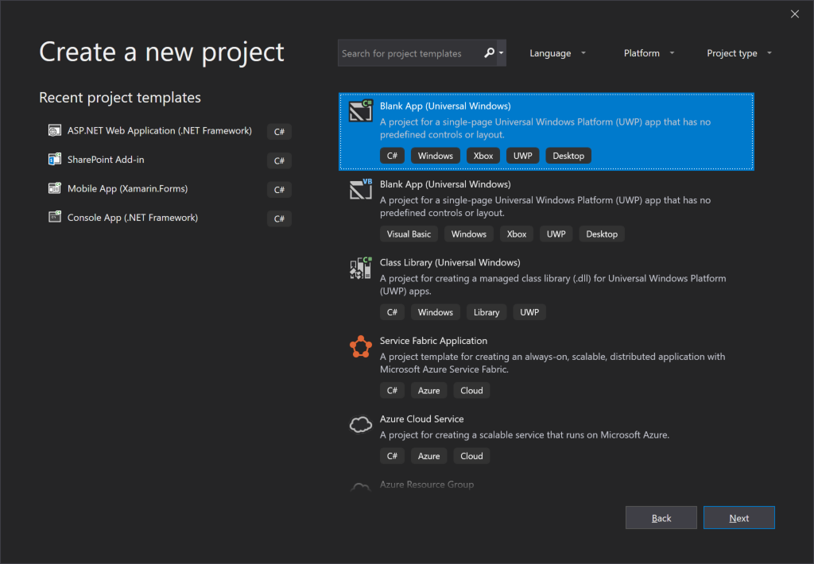
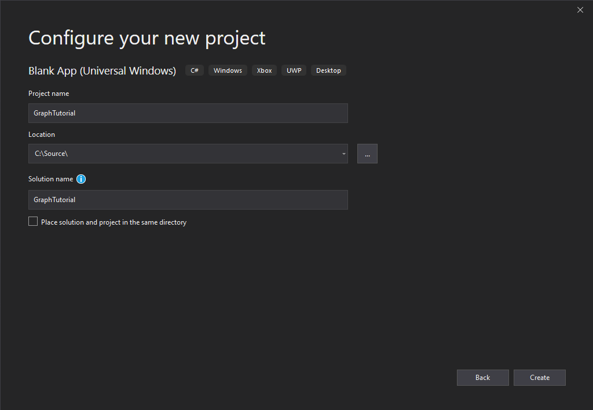

<!-- markdownlint-disable MD002 MD041 -->

<span data-ttu-id="474ab-101">Abra Visual Studio y seleccione **crear un nuevo proyecto**.</span><span class="sxs-lookup"><span data-stu-id="474ab-101">Open Visual Studio, and select **Create a new project**.</span></span> <span data-ttu-id="474ab-102">Elija la opción **aplicación en blanco (Windows universal)** que usa C# y luego seleccione **siguiente**.</span><span class="sxs-lookup"><span data-stu-id="474ab-102">Choose the **Blank App (Universal Windows)** option that uses C#, then select **Next**.</span></span>



<span data-ttu-id="474ab-104">En el cuadro de diálogo **configurar el nuevo proyecto** , escriba `graph-tutorial` en el campo **nombre del proyecto** y seleccione **crear**.</span><span class="sxs-lookup"><span data-stu-id="474ab-104">In the **Configure your new project** dialog, enter `graph-tutorial` in the **Project name** field and select **Create**.</span></span>



> [!IMPORTANT]
> <span data-ttu-id="474ab-106">Asegúrese de que escribe exactamente el mismo nombre para el proyecto de Visual Studio que se especifica en estas instrucciones de la práctica.</span><span class="sxs-lookup"><span data-stu-id="474ab-106">Ensure that you enter the exact same name for the Visual Studio Project that is specified in these lab instructions.</span></span> <span data-ttu-id="474ab-107">El nombre del proyecto de Visual Studio se convierte en parte del espacio de nombres en el código.</span><span class="sxs-lookup"><span data-stu-id="474ab-107">The Visual Studio Project name becomes part of the namespace in the code.</span></span> <span data-ttu-id="474ab-108">El código incluido en estas instrucciones depende del espacio de nombres que coincida con el nombre de proyecto de Visual Studio especificado en estas instrucciones.</span><span class="sxs-lookup"><span data-stu-id="474ab-108">The code inside these instructions depends on the namespace matching the Visual Studio Project name specified in these instructions.</span></span> <span data-ttu-id="474ab-109">Si usa un nombre de proyecto diferente, el código no se compilará a menos que ajuste todos los espacios de nombres para que se correspondan con el nombre del proyecto de Visual Studio que ha especificado al crear el proyecto.</span><span class="sxs-lookup"><span data-stu-id="474ab-109">If you use a different project name the code will not compile unless you adjust all the namespaces to match the Visual Studio Project name you enter when you create the project.</span></span>

<span data-ttu-id="474ab-110">Seleccione **Aceptar**.</span><span class="sxs-lookup"><span data-stu-id="474ab-110">Select **OK**.</span></span> <span data-ttu-id="474ab-111">En el cuadro de diálogo **nuevo proyecto de la plataforma universal de Windows** , asegúrese de que la **versión mínima** esté establecida en `Windows 10 Fall Creators Update (10.0; Build 16299)` o posterior y seleccione **Aceptar**.</span><span class="sxs-lookup"><span data-stu-id="474ab-111">In the **New Universal Windows Platform Project** dialog, ensure that the **Minimum version** is set to `Windows 10 Fall Creators Update (10.0; Build 16299)` or later and select **OK**.</span></span>

<span data-ttu-id="474ab-112">Antes de continuar, instale algunos paquetes NuGet adicionales que usará más adelante.</span><span class="sxs-lookup"><span data-stu-id="474ab-112">Before moving on, install some additional NuGet packages that you will use later.</span></span>

- <span data-ttu-id="474ab-113">[Microsoft. Toolkit. UWP. UI. Controls](https://www.nuget.org/packages/Microsoft.Toolkit.Uwp.Ui.Controls/) para agregar controles de interfaz de usuario para notificaciones en la aplicación y indicadores de carga.</span><span class="sxs-lookup"><span data-stu-id="474ab-113">[Microsoft.Toolkit.Uwp.Ui.Controls](https://www.nuget.org/packages/Microsoft.Toolkit.Uwp.Ui.Controls/) to add some UI controls for in-app notifications and loading indicators.</span></span>
- <span data-ttu-id="474ab-114">[Microsoft. Toolkit. UWP. UI. Controls. DataGrid](https://www.nuget.org/packages/Microsoft.Toolkit.Uwp.Ui.Controls.DataGrid/) para mostrar la información devuelta por Microsoft Graph.</span><span class="sxs-lookup"><span data-stu-id="474ab-114">[Microsoft.Toolkit.Uwp.Ui.Controls.DataGrid](https://www.nuget.org/packages/Microsoft.Toolkit.Uwp.Ui.Controls.DataGrid/) to display the information returned by Microsoft Graph.</span></span>
- <span data-ttu-id="474ab-115">[Microsoft. Toolkit. UWP. UI. Controls. Graph](https://www.nuget.org/packages/Microsoft.Toolkit.Uwp.Ui.Controls.Graph/) para controlar el inicio de sesión y la recuperación de tokens de acceso.</span><span class="sxs-lookup"><span data-stu-id="474ab-115">[Microsoft.Toolkit.Uwp.Ui.Controls.Graph](https://www.nuget.org/packages/Microsoft.Toolkit.Uwp.Ui.Controls.Graph/) to handle login and access token retrieval.</span></span>
- <span data-ttu-id="474ab-116">[Microsoft. Graph](https://www.nuget.org/packages/Microsoft.Graph/) para realizar llamadas a Microsoft Graph.</span><span class="sxs-lookup"><span data-stu-id="474ab-116">[Microsoft.Graph](https://www.nuget.org/packages/Microsoft.Graph/) for making calls to the Microsoft Graph.</span></span>

<span data-ttu-id="474ab-117">Seleccione **herramientas > el administrador de paquetes de NuGet > consola del administrador de paquetes**.</span><span class="sxs-lookup"><span data-stu-id="474ab-117">Select **Tools > NuGet Package Manager > Package Manager Console**.</span></span> <span data-ttu-id="474ab-118">En la consola del administrador de paquetes, escriba los siguientes comandos.</span><span class="sxs-lookup"><span data-stu-id="474ab-118">In the Package Manager Console, enter the following commands.</span></span>

```Powershell
Install-Package Microsoft.Toolkit.Uwp.Ui.Controls -Version 6.0.0
Install-Package Microsoft.Toolkit.Uwp.Ui.Controls.DataGrid -Version 6.0.0
Install-Package Microsoft.Toolkit.Uwp.Ui.Controls.Graph -Version 6.0.0
Install-Package Microsoft.Graph -Version 1.20.0
```

## <a name="design-the-app"></a><span data-ttu-id="474ab-119">Diseñar la aplicación</span><span class="sxs-lookup"><span data-stu-id="474ab-119">Design the app</span></span>

<span data-ttu-id="474ab-120">Empiece agregando una variable de nivel de aplicación para realizar un seguimiento del estado de autenticación.</span><span class="sxs-lookup"><span data-stu-id="474ab-120">Start by adding an application-level variable to track authentication state.</span></span> <span data-ttu-id="474ab-121">En el explorador de soluciones, expanda **app. Xaml** y Abra **app.Xaml.CS**.</span><span class="sxs-lookup"><span data-stu-id="474ab-121">In Solution Explorer, expand **App.xaml** and open **App.xaml.cs**.</span></span> <span data-ttu-id="474ab-122">Agregue la siguiente propiedad a la `App` clase.</span><span class="sxs-lookup"><span data-stu-id="474ab-122">Add the following property to the `App` class.</span></span>

```cs
public bool IsAuthenticated { get; set; }
```

<span data-ttu-id="474ab-123">A continuación, defina el diseño de la Página principal.</span><span class="sxs-lookup"><span data-stu-id="474ab-123">Next, define the layout for the main page.</span></span> <span data-ttu-id="474ab-124">Abra `MainPage.xaml` y reemplace todo el contenido por lo siguiente.</span><span class="sxs-lookup"><span data-stu-id="474ab-124">Open `MainPage.xaml` and replace its entire contents with the following.</span></span>

```xml
<Page
    x:Class="graph_tutorial.MainPage"
    xmlns="http://schemas.microsoft.com/winfx/2006/xaml/presentation"
    xmlns:x="http://schemas.microsoft.com/winfx/2006/xaml"
    xmlns:local="using:graph_tutorial"
    xmlns:d="http://schemas.microsoft.com/expression/blend/2008"
    xmlns:mc="http://schemas.openxmlformats.org/markup-compatibility/2006"
    xmlns:controls="using:Microsoft.Toolkit.Uwp.UI.Controls"
    xmlns:graphControls="using:Microsoft.Toolkit.Uwp.UI.Controls.Graph"
    mc:Ignorable="d"
    Background="{ThemeResource ApplicationPageBackgroundThemeBrush}">

    <Grid>
        <NavigationView x:Name="NavView"
            IsSettingsVisible="False"
            ItemInvoked="NavView_ItemInvoked">

            <NavigationView.Header>
                <graphControls:AadLogin x:Name="Login"
                    HorizontalAlignment="Left"
                    View="SmallProfilePhotoLeft"
                    AllowSignInAsDifferentUser="False"
                    />
            </NavigationView.Header>

            <NavigationView.MenuItems>
                <NavigationViewItem Content="Home" x:Name="Home" Tag="home">
                    <NavigationViewItem.Icon>
                        <FontIcon Glyph="&#xE10F;"/>
                    </NavigationViewItem.Icon>
                </NavigationViewItem>
                <NavigationViewItem Content="Calendar" x:Name="Calendar" Tag="calendar">
                    <NavigationViewItem.Icon>
                        <FontIcon Glyph="&#xE163;"/>
                    </NavigationViewItem.Icon>
                </NavigationViewItem>
            </NavigationView.MenuItems>

            <StackPanel>
                <controls:InAppNotification x:Name="Notification" ShowDismissButton="true" />
                <Frame x:Name="RootFrame" Margin="24, 0" />
            </StackPanel>
        </NavigationView>
    </Grid>
</Page>
```

<span data-ttu-id="474ab-125">Define un [NavigationView](https://docs.microsoft.com/uwp/api/windows.ui.xaml.controls.navigationview) básico con vínculos de navegación de **calendario** y **hogares** para actuar como la vista principal de la aplicación.</span><span class="sxs-lookup"><span data-stu-id="474ab-125">This defines a basic [NavigationView](https://docs.microsoft.com/uwp/api/windows.ui.xaml.controls.navigationview) with **Home** and **Calendar** navigation links to act as the main view of the app.</span></span> <span data-ttu-id="474ab-126">También agrega un control [AadLogin](https://docs.microsoft.com/dotnet/api/microsoft.toolkit.uwp.ui.controls.graph.aadlogin?view=win-comm-toolkit-dotnet-stable) en el encabezado de la vista.</span><span class="sxs-lookup"><span data-stu-id="474ab-126">It also adds an [AadLogin](https://docs.microsoft.com/dotnet/api/microsoft.toolkit.uwp.ui.controls.graph.aadlogin?view=win-comm-toolkit-dotnet-stable) control in the header of the view.</span></span> <span data-ttu-id="474ab-127">Ese control permitirá al usuario iniciar y cerrar sesión. El control no está totalmente habilitado todavía, se configurará en un ejercicio posterior.</span><span class="sxs-lookup"><span data-stu-id="474ab-127">That control will allow the user to sign in and out. The control isn't fully enabled yet, you will configure it in a later exercise.</span></span>

<span data-ttu-id="474ab-128">Ahora, agregue otra página XAML para la vista de inicio.</span><span class="sxs-lookup"><span data-stu-id="474ab-128">Now add another XAML page for the Home view.</span></span> <span data-ttu-id="474ab-129">Haga clic con el botón secundario en el proyecto de **tutorial gráfico** en el explorador de soluciones y seleccione **Agregar > nuevo elemento..**.. Elija **página en blanco**, `HomePage.xaml` escriba en el campo **nombre** y seleccione **Agregar**.</span><span class="sxs-lookup"><span data-stu-id="474ab-129">Right-click the **graph-tutorial** project in Solution Explorer and select **Add > New Item...**. Choose **Blank Page**, enter `HomePage.xaml` in the **Name** field, and select **Add**.</span></span> <span data-ttu-id="474ab-130">Agregue el siguiente código dentro del `<Grid>` elemento en el archivo.</span><span class="sxs-lookup"><span data-stu-id="474ab-130">Add the following code inside the `<Grid>` element in the file.</span></span>

```xml
<StackPanel>
    <TextBlock FontSize="44" FontWeight="Bold" Margin="0, 12">Microsoft Graph UWP Tutorial</TextBlock>
    <TextBlock x:Name="HomePageMessage">Please sign in to continue.</TextBlock>
</StackPanel>
```

<span data-ttu-id="474ab-131">Ahora, expanda **mainpage. Xaml** en el explorador `MainPage.xaml.cs`de soluciones y abra.</span><span class="sxs-lookup"><span data-stu-id="474ab-131">Now expand **MainPage.xaml** in Solution Explorer and open `MainPage.xaml.cs`.</span></span> <span data-ttu-id="474ab-132">Agregue la siguiente función a la `MainPage` clase para administrar el estado de autenticación.</span><span class="sxs-lookup"><span data-stu-id="474ab-132">Add the following function to the `MainPage` class to manage authentication state.</span></span>

```cs
private void SetAuthState(bool isAuthenticated)
{
    (App.Current as App).IsAuthenticated = isAuthenticated;

    // Toggle controls that require auth
    Calendar.IsEnabled = isAuthenticated;
}
```

<span data-ttu-id="474ab-133">Agregue el siguiente código al `MainPage()` constructor **después** de la `this.InitializeComponent();` línea.</span><span class="sxs-lookup"><span data-stu-id="474ab-133">Add the following code to the `MainPage()` constructor **after** the `this.InitializeComponent();` line.</span></span>

```cs
// Initialize auth state to false
SetAuthState(false);

// Navigate to HomePage.xaml
RootFrame.Navigate(typeof(HomePage));
```

<span data-ttu-id="474ab-134">Cuando la aplicación se inicie por primera vez, inicializará el estado `false` de autenticación en y navegará a la Página principal.</span><span class="sxs-lookup"><span data-stu-id="474ab-134">When the app first starts, it will initialize the authentication state to `false` and navigate to the home page.</span></span>

<span data-ttu-id="474ab-135">Agregue el siguiente controlador de eventos para cargar la página solicitada cuando el usuario selecciona un elemento de la vista de navegación.</span><span class="sxs-lookup"><span data-stu-id="474ab-135">Add the following event handler to load the requested page when the user selects an item from the navigation view.</span></span>

```cs
private void NavView_ItemInvoked(NavigationView sender, NavigationViewItemInvokedEventArgs args)
{
    var invokedItem = args.InvokedItem as string;

    switch (invokedItem.ToLower())
    {
        case "calendar":
            throw new NotImplementedException();
            break;
        case "home":
        default:
            RootFrame.Navigate(typeof(HomePage));
            break;
    }
}
```

<span data-ttu-id="474ab-136">Guarde todos los cambios y, a continuación, presione **F5** o seleccione **depurar > iniciar depuración** en Visual Studio.</span><span class="sxs-lookup"><span data-stu-id="474ab-136">Save all of your changes, then press **F5** or select **Debug > Start Debugging** in Visual Studio.</span></span>

> [!NOTE]
> <span data-ttu-id="474ab-137">Asegúrese de seleccionar la configuración adecuada para su equipo (ARM, x64, x86).</span><span class="sxs-lookup"><span data-stu-id="474ab-137">Make sure you select the appropriate configuration for your machine (ARM, x64, x86).</span></span>


