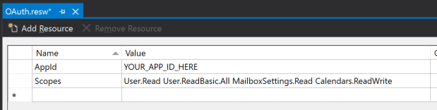

<!-- markdownlint-disable MD002 MD041 -->

<span data-ttu-id="034b5-101">En este ejercicio, ampliará la aplicación del ejercicio anterior para admitir la autenticación con Azure AD.</span><span class="sxs-lookup"><span data-stu-id="034b5-101">In this exercise you will extend the application from the previous exercise to support authentication with Azure AD.</span></span> <span data-ttu-id="034b5-102">Esto es necesario para obtener el token de acceso de OAuth necesario para llamar a Microsoft Graph.</span><span class="sxs-lookup"><span data-stu-id="034b5-102">This is required to obtain the necessary OAuth access token to call the Microsoft Graph.</span></span> <span data-ttu-id="034b5-103">En este paso, integrará el control **LoginButton** de los [controles de Windows Graph](https://github.com/windows-toolkit/Graph-Controls) en la aplicación.</span><span class="sxs-lookup"><span data-stu-id="034b5-103">In this step you will integrate the **LoginButton** control from the [Windows Graph Controls](https://github.com/windows-toolkit/Graph-Controls) into the application.</span></span>

1. <span data-ttu-id="034b5-104">Haga clic con el botón secundario en el proyecto **GraphTutorial** en el explorador de soluciones y seleccione **Agregar > nuevo elemento..**.. Elija el **archivo de recursos (. resw)**, asigne un nombre al archivo `OAuth.resw` y seleccione **Agregar**.</span><span class="sxs-lookup"><span data-stu-id="034b5-104">Right-click the **GraphTutorial** project in Solution Explorer and select **Add > New Item...**. Choose **Resources File (.resw)**, name the file `OAuth.resw` and select **Add**.</span></span> <span data-ttu-id="034b5-105">Cuando el nuevo archivo se abra en Visual Studio, cree dos recursos de la siguiente manera.</span><span class="sxs-lookup"><span data-stu-id="034b5-105">When the new file opens in Visual Studio, create two resources as follows.</span></span>

    - <span data-ttu-id="034b5-106">**Name:** `AppId` , **Value:** el identificador de la aplicación que ha generado en el portal de registro de aplicaciones</span><span class="sxs-lookup"><span data-stu-id="034b5-106">**Name:** `AppId`, **Value:** the app ID you generated in Application Registration Portal</span></span>
    - <span data-ttu-id="034b5-107">**Nombre:** `Scopes` , **valor:**`User.Read User.ReadBasic.All People.Read MailboxSettings.Read Calendars.ReadWrite`</span><span class="sxs-lookup"><span data-stu-id="034b5-107">**Name:** `Scopes`, **Value:** `User.Read User.ReadBasic.All People.Read MailboxSettings.Read Calendars.ReadWrite`</span></span>

    

    > [!IMPORTANT]
    > <span data-ttu-id="034b5-109">Si usa un control de código fuente como GIT, ahora sería un buen momento para excluir el `OAuth.resw` archivo del control de código fuente para evitar la pérdida inadvertida del identificador de la aplicación.</span><span class="sxs-lookup"><span data-stu-id="034b5-109">If you're using source control such as git, now would be a good time to exclude the `OAuth.resw` file from source control to avoid inadvertently leaking your app ID.</span></span>

## <a name="configure-the-loginbutton-control"></a><span data-ttu-id="034b5-110">Configurar el control LoginButton</span><span class="sxs-lookup"><span data-stu-id="034b5-110">Configure the LoginButton control</span></span>

1. <span data-ttu-id="034b5-111">Abra `MainPage.xaml.cs` y agregue la siguiente `using` instrucción a la parte superior del archivo.</span><span class="sxs-lookup"><span data-stu-id="034b5-111">Open `MainPage.xaml.cs` and add the following `using` statement to the top of the file.</span></span>

    ```csharp
    using Microsoft.Toolkit.Graph.Providers;
    ```

1. <span data-ttu-id="034b5-112">Reemplace el constructor existente por lo siguiente.</span><span class="sxs-lookup"><span data-stu-id="034b5-112">Replace the existing constructor with the following.</span></span>

    :::code language="csharp" source="../demo/GraphTutorial/MainPage.xaml.cs" id="ConstructorSnippet":::

    <span data-ttu-id="034b5-113">Este código carga la configuración desde `OAuth.resw` e inicializa el proveedor de MSAL con esos valores.</span><span class="sxs-lookup"><span data-stu-id="034b5-113">This code loads the settings from `OAuth.resw` and initializes the MSAL provider with those values.</span></span>

1. <span data-ttu-id="034b5-114">Ahora, agregue un controlador de eventos para el `ProviderUpdated` evento en el `ProviderManager` .</span><span class="sxs-lookup"><span data-stu-id="034b5-114">Now add an event handler for the `ProviderUpdated` event on the `ProviderManager`.</span></span> <span data-ttu-id="034b5-115">Agregue la siguiente función a la clase `MainPage`.</span><span class="sxs-lookup"><span data-stu-id="034b5-115">Add the following function to the `MainPage` class.</span></span>

    :::code language="csharp" source="../demo/GraphTutorial/MainPage.xaml.cs" id="ProviderUpdatedSnippet":::

    <span data-ttu-id="034b5-116">Este evento se desencadena cuando cambia el proveedor o cuando cambia el estado del proveedor.</span><span class="sxs-lookup"><span data-stu-id="034b5-116">This event triggers when the provider changes, or when the provider state changes.</span></span>

1. <span data-ttu-id="034b5-117">En el explorador de soluciones, expanda **homepage. Xaml** y Abra `HomePage.xaml.cs` .</span><span class="sxs-lookup"><span data-stu-id="034b5-117">In Solution Explorer, expand **HomePage.xaml** and open `HomePage.xaml.cs`.</span></span> <span data-ttu-id="034b5-118">Reemplace el constructor existente por lo siguiente.</span><span class="sxs-lookup"><span data-stu-id="034b5-118">Replace the existing constructor with the following.</span></span>

    :::code language="csharp" source="../demo/GraphTutorial/HomePage.xaml.cs" id="ConstructorSnippet":::

1. <span data-ttu-id="034b5-119">Reinicie la aplicación y haga clic en el control de **Inicio de sesión** en la parte superior de la aplicación.</span><span class="sxs-lookup"><span data-stu-id="034b5-119">Restart the app and click the **Sign In** control at the top of the app.</span></span> <span data-ttu-id="034b5-120">Una vez que haya iniciado sesión, la interfaz de usuario debe cambiar para indicar que ha iniciado sesión correctamente.</span><span class="sxs-lookup"><span data-stu-id="034b5-120">Once you've signed in, the UI should change to indicate that you've successfully signed-in.</span></span>

    

    > [!NOTE]
    > <span data-ttu-id="034b5-122">El `ButtonLogin` control implementa la lógica del almacenamiento y la actualización del token de acceso por usted.</span><span class="sxs-lookup"><span data-stu-id="034b5-122">The `ButtonLogin` control implements the logic of storing and refreshing the access token for you.</span></span> <span data-ttu-id="034b5-123">Los tokens se almacenan en el almacenamiento seguro y se actualizan según sea necesario.</span><span class="sxs-lookup"><span data-stu-id="034b5-123">The tokens are stored in secure storage and refreshed as needed.</span></span>
