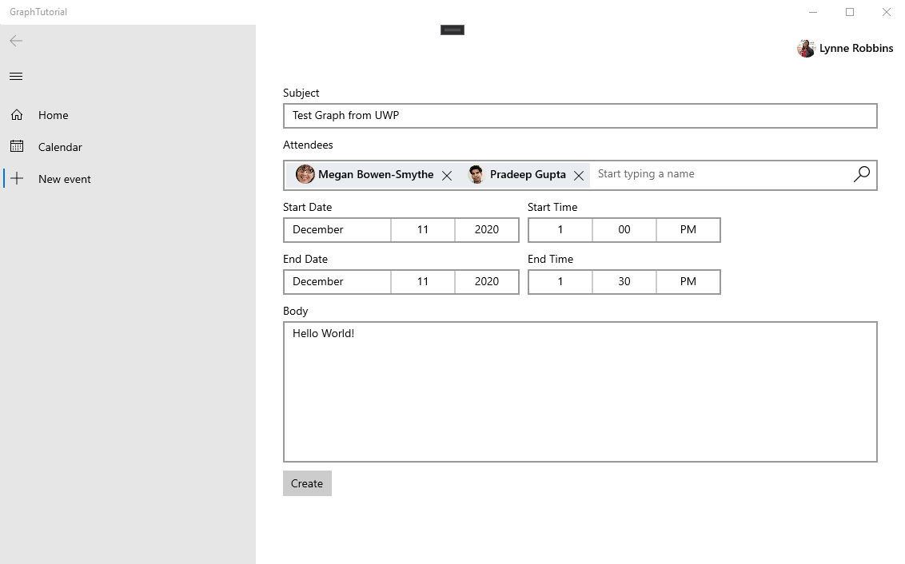

<!-- markdownlint-disable MD002 MD041 -->

<span data-ttu-id="cfb7c-101">En esta sección, agregará la capacidad de crear eventos en el calendario del usuario.</span><span class="sxs-lookup"><span data-stu-id="cfb7c-101">In this section you will add the ability to create events on the user's calendar.</span></span>

1. <span data-ttu-id="cfb7c-102">Agregue una nueva página para la nueva vista de eventos.</span><span class="sxs-lookup"><span data-stu-id="cfb7c-102">Add a new page for the new event view.</span></span> <span data-ttu-id="cfb7c-103">Haga clic con el botón secundario en el proyecto **GraphTutorial** en el explorador de soluciones y seleccione **Agregar > nuevo elemento..**.. Elija **página en blanco**, escriba `NewEventPage.xaml` en el campo **nombre** y seleccione **Agregar**.</span><span class="sxs-lookup"><span data-stu-id="cfb7c-103">Right-click the **GraphTutorial** project in Solution Explorer and select **Add > New Item...**. Choose **Blank Page**, enter `NewEventPage.xaml` in the **Name** field, and select **Add**.</span></span>

1. <span data-ttu-id="cfb7c-104">Abra **NewEventPage. Xaml** y reemplace su contenido por lo siguiente.</span><span class="sxs-lookup"><span data-stu-id="cfb7c-104">Open **NewEventPage.xaml** and replace its contents with the following.</span></span>

    :::code language="xaml" source="../demo/GraphTutorial/NewEventPage.xaml" id="NewEventPageXamlSnippet":::

1. <span data-ttu-id="cfb7c-105">Abra **NewEventPage.Xaml.CS** y agregue las siguientes `using` instrucciones en la parte superior del archivo.</span><span class="sxs-lookup"><span data-stu-id="cfb7c-105">Open **NewEventPage.xaml.cs** and add the following `using` statements to the top of the file.</span></span>

    :::code language="csharp" source="../demo/GraphTutorial/NewEventPage.xaml.cs" id="UsingStatementsSnippet":::

1. <span data-ttu-id="cfb7c-106">Agregue la interfaz **INotifyPropertyChange** a la clase **NewEventPage** .</span><span class="sxs-lookup"><span data-stu-id="cfb7c-106">Add the **INotifyPropertyChange** interface to the **NewEventPage** class.</span></span> <span data-ttu-id="cfb7c-107">Reemplace la declaración de clase existente por lo siguiente.</span><span class="sxs-lookup"><span data-stu-id="cfb7c-107">Replace the existing class declaration with the following.</span></span>

    ```csharp
    public sealed partial class NewEventPage : Page, INotifyPropertyChanged
    {
        public NewEventPage()
        {
            this.InitializeComponent();
            DataContext = this;
        }
    }
    ```

1. <span data-ttu-id="cfb7c-108">Agregue las siguientes propiedades a la clase **NewEventPage** .</span><span class="sxs-lookup"><span data-stu-id="cfb7c-108">Add the following properties to the **NewEventPage** class.</span></span>

    :::code language="csharp" source="../demo/GraphTutorial/NewEventPage.xaml.cs" id="PropertiesSnippet":::

1. <span data-ttu-id="cfb7c-109">Agregue el siguiente código para obtener la zona horaria del usuario de Microsoft Graph cuando se cargue la página.</span><span class="sxs-lookup"><span data-stu-id="cfb7c-109">Add the following code to get the user's time zone from Microsoft Graph when the page loads.</span></span>

    :::code language="csharp" source="../demo/GraphTutorial/NewEventPage.xaml.cs" id="LoadTimeZoneSnippet":::

1. <span data-ttu-id="cfb7c-110">Agregue el código siguiente para crear el evento.</span><span class="sxs-lookup"><span data-stu-id="cfb7c-110">Add the following code to create the event.</span></span>

    :::code language="csharp" source="../demo/GraphTutorial/NewEventPage.xaml.cs" id="CreateEventSnippet":::

1. <span data-ttu-id="cfb7c-111">Modifique el `NavView_ItemInvoked` método en el archivo **mainpage.Xaml.CS** para reemplazar la `switch` instrucción existente por lo siguiente.</span><span class="sxs-lookup"><span data-stu-id="cfb7c-111">Modify the `NavView_ItemInvoked` method in the **MainPage.xaml.cs** file to replace the existing `switch` statement with the following.</span></span>

    ```csharp
    switch (invokedItem.ToLower())
    {
        case "new event":
            RootFrame.Navigate(typeof(NewEventPage));
            break;
        case "calendar":
            RootFrame.Navigate(typeof(CalendarPage));
            break;
        case "home":
        default:
            RootFrame.Navigate(typeof(HomePage));
            break;
    }
    ```

1. <span data-ttu-id="cfb7c-112">Guarde los cambios y ejecute la aplicación.</span><span class="sxs-lookup"><span data-stu-id="cfb7c-112">Save your changes and run the app.</span></span> <span data-ttu-id="cfb7c-113">Inicie sesión, seleccione el elemento de menú **nuevo evento** , rellene el formulario y seleccione **crear** para agregar un evento al calendario del usuario.</span><span class="sxs-lookup"><span data-stu-id="cfb7c-113">Sign in, select the **New event** menu item, fill in the form, and select **Create** to add an event to the user's calendar.</span></span>

    
