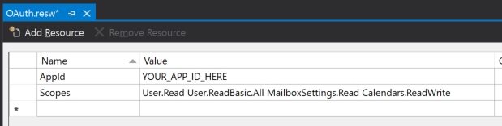
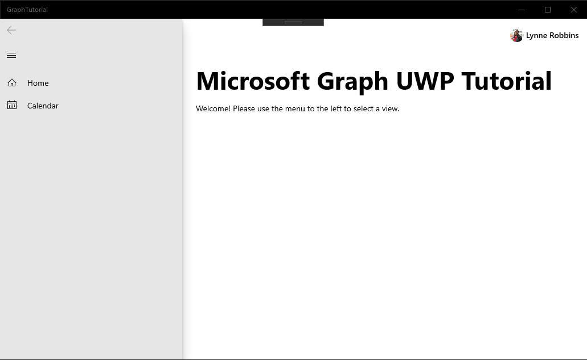

<!-- markdownlint-disable MD002 MD041 -->

En este ejercicio, ampliará la aplicación del ejercicio anterior para admitir la autenticación con Azure AD. Esto es necesario para obtener el token de acceso de OAuth necesario para llamar a Microsoft Graph. En este paso, integrará el control [AadLogin](https://docs.microsoft.com/dotnet/api/microsoft.toolkit.uwp.ui.controls.graph.aadlogin?view=win-comm-toolkit-dotnet-stable) desde el [Kit de herramientas](https://github.com/Microsoft/WindowsCommunityToolkit) de la comunidad de Windows en la aplicación.

Haga clic con el botón secundario en el proyecto de **tutorial gráfico** en el explorador de soluciones y elija **Agregar > nuevo elemento..**.. Elija el **archivo de recursos (. resw)**, asigne `OAuth.resw` un nombre al archivo y elija **Agregar**. Cuando el nuevo archivo se abra en Visual Studio, cree dos recursos de la siguiente manera.

- **Name:** `AppId`, **Valor:** el identificador de la aplicación que ha generado en el portal de registro de aplicaciones
- **Name:** `Scopes`, **Valor:**`User.Read Calendars.Read`



> [!IMPORTANT]
> Si usa un control de código fuente como GIT, ahora sería un buen momento para excluir el `OAuth.resw` archivo del control de código fuente para evitar la pérdida inadvertida del identificador de la aplicación.

## <a name="configure-the-aadlogin-control"></a>Configurar el control AadLogin

Empiece agregando código para leer los valores del archivo de recursos. Abra `MainPage.xaml.cs` y agregue la siguiente `using` instrucción a la parte superior del archivo.

```cs
using Microsoft.Toolkit.Services.MicrosoftGraph;
```

Reemplace la línea `RootFrame.Navigate(typeof(HomePage));` por el siguiente código.

```cs
// Load OAuth settings
var oauthSettings = Windows.ApplicationModel.Resources.ResourceLoader.GetForCurrentView("OAuth");
var appId = oauthSettings.GetString("AppId");
var scopes = oauthSettings.GetString("Scopes");

if (string.IsNullOrEmpty(appId) || string.IsNullOrEmpty(scopes))
{
    Notification.Show("Could not load OAuth Settings from resource file.");
}
else
{
    // Initialize Graph
    MicrosoftGraphService.Instance.AuthenticationModel = MicrosoftGraphEnums.AuthenticationModel.V2;
    MicrosoftGraphService.Instance.Initialize(appId,
        MicrosoftGraphEnums.ServicesToInitialize.UserProfile,
        scopes.Split(' '));

    // Navigate to HomePage.xaml
    RootFrame.Navigate(typeof(HomePage));
}
```

Este código carga la configuración desde `OAuth.resw` e inicializa la instancia global de `MicrosoftGraphService` con esos valores.

Ahora, agregue un controlador de eventos `SignInCompleted` para el evento `AadLogin` en el control. Abra el `MainPage.xaml` archivo y reemplace el elemento `<graphControls:AadLogin>` existente por lo siguiente.

```xml
<graphControls:AadLogin x:Name="Login"
    HorizontalAlignment="Left"
    View="SmallProfilePhotoLeft"
    AllowSignInAsDifferentUser="False"
    SignInCompleted="Login_SignInCompleted"
    SignOutCompleted="Login_SignOutCompleted"
    />
```

A continuación, agregue las siguientes funciones `MainPage` a la `MainPage.xaml.cs`clase en.

```cs
private void Login_SignInCompleted(object sender, Microsoft.Toolkit.Uwp.UI.Controls.Graph.SignInEventArgs e)
{
    // Set the auth state
    SetAuthState(true);
    // Reload the home page
    RootFrame.Navigate(typeof(HomePage));
}

private void Login_SignOutCompleted(object sender, EventArgs e)
{
    // Set the auth state
    SetAuthState(false);
    // Reload the home page
    RootFrame.Navigate(typeof(HomePage));
}
```

Por último, en el explorador de soluciones, expanda **homepage. Xaml** y Abra `HomePage.xaml.cs`. Agregue el siguiente código después de `this.InitializeComponent();` la línea.

```cs
if ((App.Current as App).IsAuthenticated)
{
    HomePageMessage.Text = "Welcome! Please use the menu to the left to select a view.";
}
```

ReInicie la aplicación y haga clic en el control de **Inicio de sesión** en la parte superior de la aplicación. Una vez que haya iniciado sesión, la interfaz de usuario debe cambiar para indicar que ha iniciado sesión correctamente.



> [!NOTE]
> El `AadLogin` control implementa la lógica del almacenamiento y la actualización del token de acceso por usted. Los tokens se almacenan en el almacenamiento seguro y se actualizan según sea necesario.