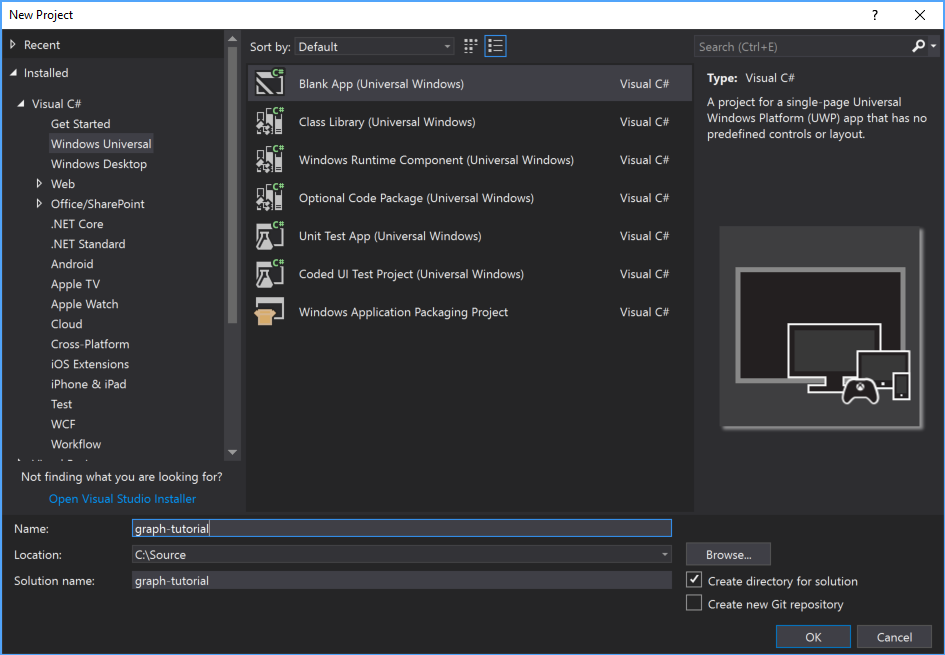
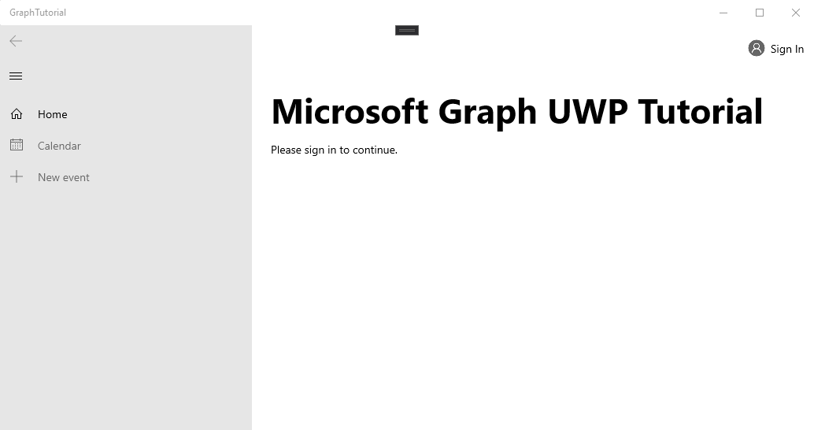

<!-- markdownlint-disable MD002 MD041 -->

Abra Visual Studio y seleccione **archivo _GT_ nuevo _GT_ proyecto**. En el cuadro de diálogo **nuevo proyecto** , haga lo siguiente:

1. Seleccione **plantillas _GT_ Visual C# _GT_ Windows universal**.
1. Selecciona **aplicación en blanco (Windows universal)**.
1. Escriba **gráfico: tutorial** para el nombre del proyecto.



> [!IMPORTANT]
> Asegúrese de que escribe exactamente el mismo nombre para el proyecto de Visual Studio que se especifica en estas instrucciones de la práctica. El nombre del proyecto de Visual Studio se convierte en parte del espacio de nombres en el código. El código incluido en estas instrucciones depende del espacio de nombres que coincida con el nombre de proyecto de Visual Studio especificado en estas instrucciones. Si usa un nombre de proyecto diferente, el código no se compilará a menos que ajuste todos los espacios de nombres para que se correspondan con el nombre del proyecto de Visual Studio que ha especificado al crear el proyecto.

Haga clic en **Aceptar**. En el cuadro de diálogo **nuevo proyecto de la plataforma universal de Windows** , asegúrese de que la **versión mínima** esté establecida en `Windows 10 Fall Creators Update (10.0; Build 16299)` o posterior y seleccione **Aceptar**.

Antes de continuar, instale algunos paquetes NuGet adicionales que usará más adelante.

- [Microsoft. Toolkit. UWP. UI. Controls](https://www.nuget.org/packages/Microsoft.Toolkit.Uwp.Ui.Controls/) para agregar controles de interfaz de usuario para notificaciones en la aplicación y indicadores de carga.
- [Microsoft. Toolkit. UWP. UI. Controls. DataGrid](https://www.nuget.org/packages/Microsoft.Toolkit.Uwp.Ui.Controls.DataGrid/) para mostrar la información devuelta por Microsoft Graph.
- [Microsoft. Toolkit. UWP. UI. Controls. Graph](https://www.nuget.org/packages/Microsoft.Toolkit.Uwp.Ui.Controls.Graph/) para controlar el inicio de sesión y la recuperación de tokens de acceso.
- [Microsoft. Graph](https://www.nuget.org/packages/Microsoft.Graph/) para realizar llamadas a Microsoft Graph.

Seleccione **herramientas > el administrador de paquetes de NuGet _GT_ la consola del administrador de paquetes**. En la consola del administrador de paquetes, escriba los siguientes comandos.

```Powershell
Install-Package Microsoft.Toolkit.Uwp.Ui.Controls
Install-Package Microsoft.Toolkit.Uwp.Ui.Controls.DataGrid
Install-Package Microsoft.Toolkit.Uwp.Ui.Controls.Graph
Install-Package Microsoft.Graph
```

## <a name="design-the-app"></a>Diseñar la aplicación

Empiece agregando una variable de nivel de aplicación para realizar un seguimiento del estado de autenticación. En el explorador de soluciones, expanda **app. Xaml** y Abra **app.Xaml.CS**. Agregue la siguiente propiedad a la `App` clase.

```cs
public bool IsAuthenticated { get; set; }
```

A continuación, defina el diseño de la Página principal. Abra `MainPage.xaml` y reemplace todo el contenido por lo siguiente.

```xml
<Page
    x:Class="graph_tutorial.MainPage"
    xmlns="http://schemas.microsoft.com/winfx/2006/xaml/presentation"
    xmlns:x="http://schemas.microsoft.com/winfx/2006/xaml"
    xmlns:local="using:graph_tutorial"
    xmlns:d="http://schemas.microsoft.com/expression/blend/2008"
    xmlns:mc="http://schemas.openxmlformats.org/markup-compatibility/2006"
    xmlns:controls="using:Microsoft.Toolkit.Uwp.UI.Controls"
    xmlns:graphControls="using:Microsoft.Toolkit.Uwp.UI.Controls.Graph"
    mc:Ignorable="d"
    Background="{ThemeResource ApplicationPageBackgroundThemeBrush}">

    <Grid>
        <NavigationView x:Name="NavView"
            IsSettingsVisible="False"
            ItemInvoked="NavView_ItemInvoked">

            <NavigationView.Header>
                <graphControls:AadLogin x:Name="Login"
                    HorizontalAlignment="Left"
                    View="SmallProfilePhotoLeft"
                    AllowSignInAsDifferentUser="False"
                    />
            </NavigationView.Header>

            <NavigationView.MenuItems>
                <NavigationViewItem Content="Home" x:Name="Home" Tag="home">
                    <NavigationViewItem.Icon>
                        <FontIcon Glyph="&#xE10F;"/>
                    </NavigationViewItem.Icon>
                </NavigationViewItem>
                <NavigationViewItem Content="Calendar" x:Name="Calendar" Tag="calendar">
                    <NavigationViewItem.Icon>
                        <FontIcon Glyph="&#xE163;"/>
                    </NavigationViewItem.Icon>
                </NavigationViewItem>
            </NavigationView.MenuItems>

            <StackPanel>
                <controls:InAppNotification x:Name="Notification" ShowDismissButton="true" />
                <Frame x:Name="RootFrame" Margin="24, 0" />
            </StackPanel>
        </NavigationView>
    </Grid>
</Page>
```

Define un [NavigationView](https://docs.microsoft.com/uwp/api/windows.ui.xaml.controls.navigationview) básico con vínculos de navegación de **calendario** y **hogares** para actuar como la vista principal de la aplicación. También agrega un control [AadLogin](https://docs.microsoft.com/dotnet/api/microsoft.toolkit.uwp.ui.controls.graph.aadlogin?view=win-comm-toolkit-dotnet-stable) en el encabezado de la vista. Ese control permitirá al usuario iniciar y cerrar sesión. El control no está totalmente habilitado todavía, se configurará en un ejercicio posterior.

Ahora, agregue otra página XAML para la vista de inicio. Haga clic con el botón secundario en el proyecto de **tutorial gráfico** en el explorador de soluciones y elija **Agregar > nuevo elemento..**.. Elija **página en blanco**, `HomePage.xaml` escriba en el campo **nombre** y elija **Agregar**. Agregue el siguiente código dentro del `<Grid>` elemento en el archivo.

```xml
<StackPanel>
    <TextBlock FontSize="44" FontWeight="Bold" Margin="0, 12">Microsoft Graph UWP Tutorial</TextBlock>
    <TextBlock x:Name="HomePageMessage">Please sign in to continue.</TextBlock>
</StackPanel>
```

Ahora, expanda **mainpage. Xaml** en el explorador `MainPage.xaml.cs`de soluciones y abra. Agregue el siguiente código al `MainPage()` constructor **después** de la `this.InitializeComponent();` línea.

```cs
// Initialize auth state to false
SetAuthState(false);

// Navigate to HomePage.xaml
RootFrame.Navigate(typeof(HomePage));
```

Cuando la aplicación se inicie por primera vez, inicializará el estado `false` de autenticación en y navegará a la Página principal.

Agregue la siguiente función a la `MainPage` clase para administrar el estado de autenticación.

```cs
private void SetAuthState(bool isAuthenticated)
{
    (App.Current as App).IsAuthenticated = isAuthenticated;

    // Toggle controls that require auth
    Calendar.IsEnabled = isAuthenticated;
}
```

Agregue el siguiente controlador de eventos para cargar la página solicitada cuando el usuario selecciona un elemento de la vista de navegación.

```cs
private void NavView_ItemInvoked(NavigationView sender, NavigationViewItemInvokedEventArgs args)
{
    var invokedItem = args.InvokedItem as string;

    switch (invokedItem.ToLower())
    {
        case "calendar":
            throw new NotImplementedException();
            break;
        case "home":
        default:
            RootFrame.Navigate(typeof(HomePage));
            break;
    }
}
```

Guarde todos los cambios y, a continuación, presione **F5** o seleccione Depurar **_GT_ iniciar** depuración en Visual Studio.

> [!NOTE]
> Asegúrese de seleccionar la configuración adecuada para su equipo (ARM, x64, x86).


