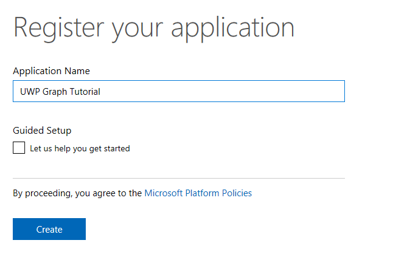
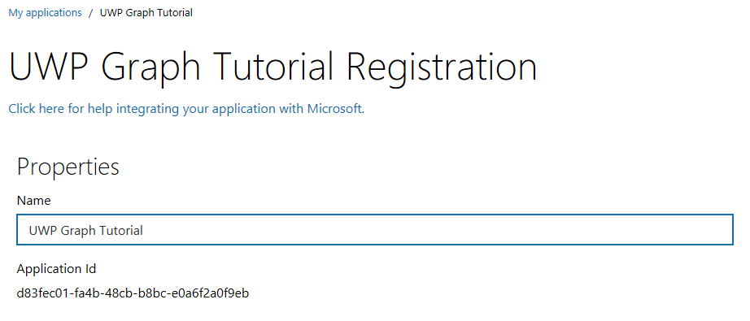
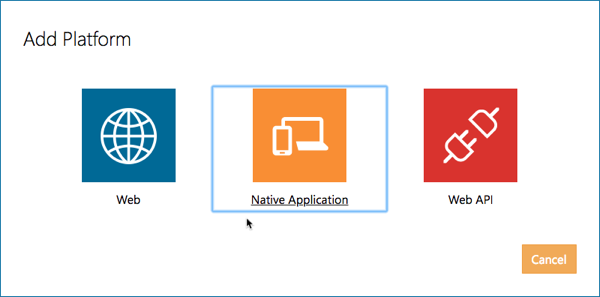

<!-- markdownlint-disable MD002 MD041 -->

En este ejercicio, creará una nueva aplicación nativa de Azure AD mediante el portal de registro de aplicaciones (ARP).

1. Abra un explorador y vaya al [portal de registro de aplicaciones](https://apps.dev.microsoft.com) e inicie sesión con una **cuenta personal** (también conocido como Microsoft Account) o una **cuenta profesional o educativa**.

1. Seleccione **Agregar una aplicación** en la parte superior de la página.

    > [!NOTE]
    > Si ve más de un botón **Agregar una aplicación** en la página, seleccione el que corresponda a la lista de **aplicaciones convergentes** .

1. En la página **registrar la aplicación** , establezca el tutorial **nombre** de la aplicación para **UWP gráfico** y seleccione **crear**.

    

1. En la página de **registro del tutorial de gráficos de UWP** , en la sección **propiedades** , copie el identificador de la **aplicación** ya que lo necesitará más adelante.

    

1. Desplácese hacia abajo hasta la sección **plataformas** .

    1. Seleccione **Agregar plataforma**.
    1. En el cuadro de diálogo **Agregar plataforma** , seleccione **aplicación nativa**.

        

1. Desplácese hasta la parte inferior de la página y seleccione **Guardar**.