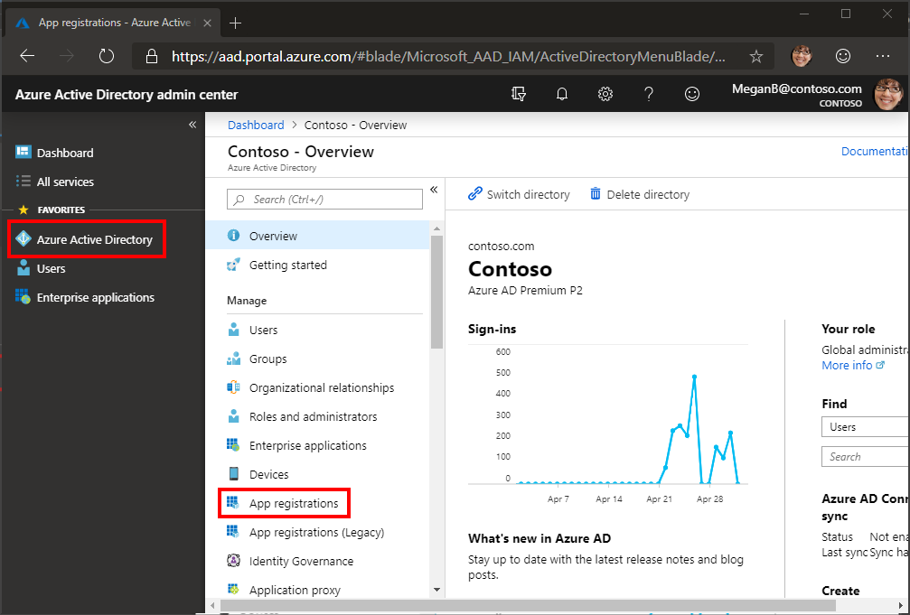

<!-- markdownlint-disable MD002 MD041 -->

En este ejercicio, creará una nueva aplicación nativa de Azure AD con el centro de administración de Azure Active Directory.

1. Abra un explorador y vaya al [centro de administración de Azure Active Directory](https://aad.portal.azure.com) e inicie sesión con una **cuenta personal** (aka: cuenta de Microsoft) o una **cuenta profesional o educativa**.

1. Seleccione **Azure Active Directory** en el panel de navegación de la izquierda y, después, seleccione **registros de aplicaciones (vista previa)** en **administrar**.

    

1. Seleccione **registro nuevo**. En la página **registrar una aplicación** , establezca los valores de la siguiente manera.

    - Establezca **el nombre** en `UWP Graph Tutorial`.
    - Establezca **tipos de cuenta compatibles** en **cuentas de cualquier directorio de la organización y cuentas personales de Microsoft**.
    - Deje el **URI** de redireccionamiento vacío.

    

1. Elija **registrar**. En la página **tutorial de gráficos de UWP** , copie el valor del identificador de la **aplicación (cliente)** y lo guarde, lo necesitará en el paso siguiente.

    

1. Seleccione el vínculo **Agregar un URI de** redireccionamiento. En la página **URI** de redireccionamiento, busque la sección **URI de redireccionamiento sugeridos para clientes públicos (móvil, escritorio)** . Seleccione el `urn:ietf:wg:oauth:2.0:oob` URI y, a continuación, elija **Guardar**.

    